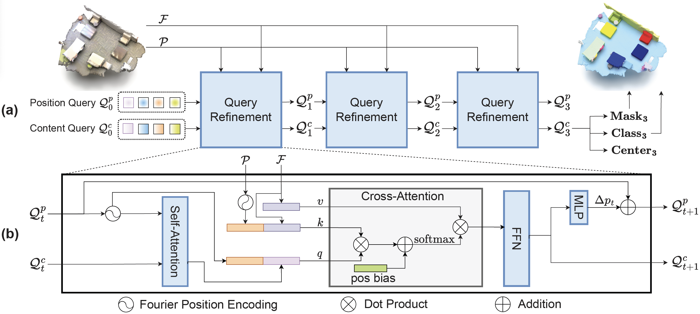

# Mask-Attention-Free Transformer for 3D Instance Segmentation (ICCV 2023)

This is the official PyTorch implementation of **MAFT** (Mask-Attention-Free Transformer) (ICCV 2023).

**Mask-Attention-Free Transformer for 3D Instance Segmentation** [\[Paper\]](https://arxiv.org/pdf/2309.01692.pdf)

Xin Lai, Yuhui Yuan, Ruihang Chu, Yukang Chen, Han Hu, Jiaya Jia 

<div align="center">
  
</div>

# Get Started

## Environment

Install dependencies
```
# install attention_rpe_ops
cd lib/attention_rpe_ops && python3 setup.py install && cd ../../

# install pointgroup_ops
cd maft/lib && python3 setup.py develop && cd ../../

# install maft
python3 setup.py develop

# install other dependencies
pip install -r requirements.txt
```

Note: Make sure you have installed `gcc` and `cuda`, and `nvcc` can work (if you install cuda by conda, it won't provide nvcc and you should install cuda manually.)

## Datasets Preparation

### ScanNetv2
(1) Download the [ScanNet](http://www.scan-net.org/) v2 dataset.

(2) Put the data in the corresponding folders. 
* Copy the files `[scene_id]_vh_clean_2.ply`,  `[scene_id]_vh_clean_2.labels.ply`,  `[scene_id]_vh_clean_2.0.010000.segs.json`  and `[scene_id].aggregation.json`  into the `dataset/scannetv2/train` and `dataset/scannetv2/val` folders according to the ScanNet v2 train/val [split](https://github.com/ScanNet/ScanNet/tree/master/Tasks/Benchmark). 

* Copy the files `[scene_id]_vh_clean_2.ply` into the `dataset/scannetv2/test` folder according to the ScanNet v2 test [split](https://github.com/ScanNet/ScanNet/tree/master/Tasks/Benchmark). 

* Put the file `scannetv2-labels.combined.tsv` in the `dataset/scannetv2` folder.

The dataset files are organized as follows.
```
PointGroup
├── dataset
│   ├── scannetv2
│   │   ├── train
│   │   │   ├── [scene_id]_vh_clean_2.ply & [scene_id]_vh_clean_2.labels.ply & [scene_id]_vh_clean_2.0.010000.segs.json & [scene_id].aggregation.json
│   │   ├── val
│   │   │   ├── [scene_id]_vh_clean_2.ply & [scene_id]_vh_clean_2.labels.ply & [scene_id]_vh_clean_2.0.010000.segs.json & [scene_id].aggregation.json
│   │   ├── test
│   │   │   ├── [scene_id]_vh_clean_2.ply 
│   │   ├── scannetv2-labels.combined.tsv
```

(3) Generate input files `[scene_id]_inst_nostuff.pth` for instance segmentation.
```
cd dataset/scannetv2
python prepare_data_inst_with_normal.py.py --data_split train
python prepare_data_inst_with_normal.py.py --data_split val
python prepare_data_inst_with_normal.py.py --data_split test
```

## Training

### ScanNetv2
```
python3 tools/train.py configs/scannet/maft_scannet.yaml
```

## Validation
```
python3 tools/train.py configs/scannet/maft_scannet.yaml --resume [MODEL_PATH] --eval_only
```

## Pre-trained Models


| dataset | AP | AP_50% | AP_25% |  Download  |
|---------------|:----:|:----:|:----:|:-----------:|
| [ScanNetv2](configs/scannet/maft_scannet.yaml) | 58.4 | 75.9 | 84.5 | [Model Weight](https://mycuhk-my.sharepoint.com/:u:/g/personal/1155154502_link_cuhk_edu_hk/Ef5k0CbafItKmVrGXQsyukcBzKfd9kNQIHu5wdCXIrRMdw?e=jEi9qk) |

# Citation
If you find this project useful, please consider citing:

```
@inproceedings{lai2023mask,
  title={Mask-Attention-Free Transformer for 3D Instance Segmentation},
  author={Lai, Xin and and Yuan, Yuhui and Chu, Ruihang and Chen, Yukang and Hu, Han and Jia, Jiaya},
  booktitle={ICCV},
  year={2023}
}
```

# Our Works on 3D Point Cloud

* **Spherical Transformer for LiDAR-based 3D Recognition (CVPR 2023)** [\[Paper\]](https://arxiv.org/pdf/2303.12766.pdf) [\[Code\]](https://github.com/dvlab-research/SphereFormer) : A plug-and-play transformer module that boosts performance for distant region (for 3D LiDAR point cloud)

* **Stratified Transformer for 3D Point Cloud Segmentation (CVPR 2022)**: [\[Paper\]](https://openaccess.thecvf.com/content/CVPR2022/papers/Lai_Stratified_Transformer_for_3D_Point_Cloud_Segmentation_CVPR_2022_paper.pdf) [\[Code\]](https://github.com/dvlab-research/Stratified-Transformer) : Point-based window transformer for 3D point cloud segmentation

* **SparseTransformer (SpTr) Library** [\[Code\]](https://github.com/dvlab-research/SparseTransformer) : A fast, memory-efficient, and easy-to-use library for sparse transformer with varying token numbers.
